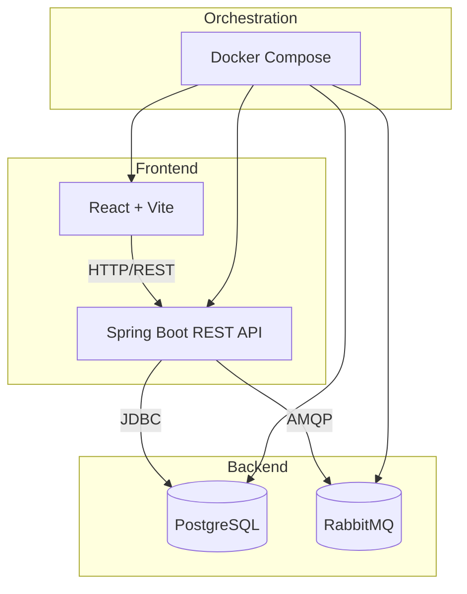
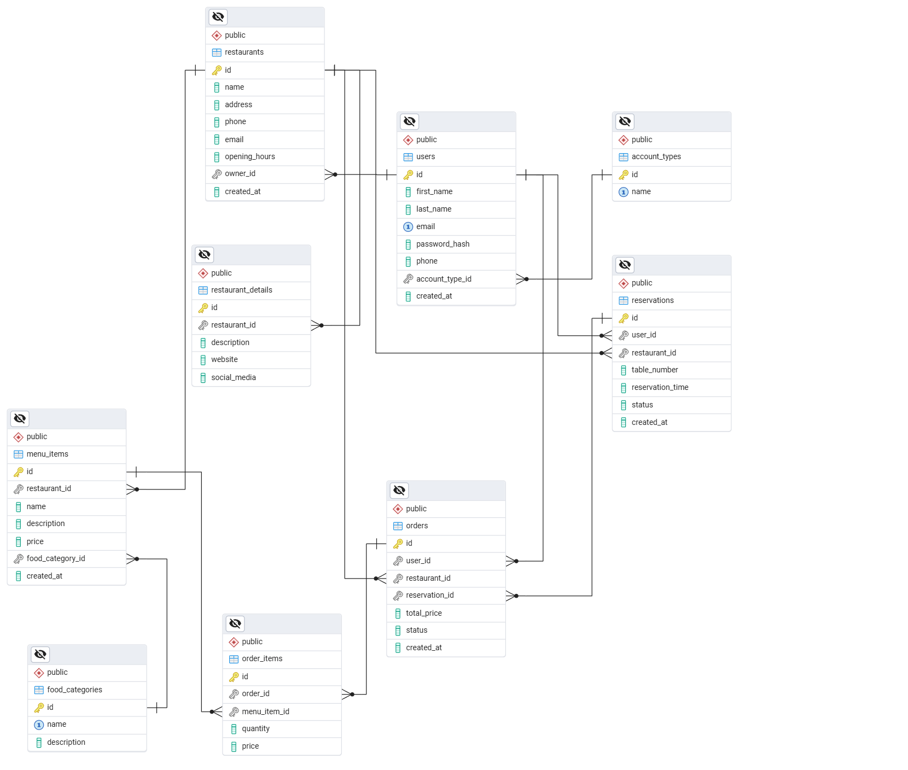

# QuickPlate

QuickPlate is a web application for managing restaurants, users, reservations, and menu items.

## Overview

The application consists of:

- **Frontend**: Built using React, Vite, and React Router.
- **Backend**: Developed with Spring Boot and exposes REST APIs.
- **Database**: PostgreSQL (with PgAdmin for management).
- **Additional Services**: RabbitMQ for messaging.

## Features

- User authentication and management.
- Restaurant and menu item management.
- Reservation handling.
- Responsive design with a user-friendly interface.

## Technologies

- **Frontend**
   - **React**: Enables building a component-based user interface with reusable code.
   - **Vite**: Provides lightning-fast development startup and rebuilds using ESBuild.
   - **React Router**: Simplifies declarative navigation and route management in SPA applications.
   - **React Icons**: Offers a wide selection of vector icons, easily integrated into React components.
   - **CSS Modules**: Scoped styles prevent class name conflicts and help maintain organized styling.

- **Backend**
   - **Spring Boot**: Automatic application configuration, embedded HTTP server, and broad Spring ecosystem support.
   - **Spring Data JPA**: Simplifies database operations through repositories and entity mapping (ORM).

- **Database**
   - **PostgreSQL**: Stable open-source relational database with support for advanced data types and extensions.

- **Other**
   - **Docker Compose**: Unified environment for all services (frontend, backend, DB, RabbitMQ) – easy to launch with a single command.
   - **Maven**: Standardized build system for Java projects, managing dependencies and plugins.
   - **ESLint**: Enforces consistent code style and detects potential issues in JavaScript/JSX code.

## Prerequisites

- [Docker](https://docs.docker.com/get-docker/) & [Docker Compose](https://docs.docker.com/compose/install/)
- Alternatively for development:
  - [Node.js](https://nodejs.org/)
  - [JDK 17](https://jdk.java.net/17/) with Maven

## Getting Started

### Running with Docker Compose

1. Open a terminal and navigate to the project root:

   ```bash
   cd QuickPlate
   ```

2. Build and start the containers:

   ```bash
   docker-compose up --build
   ```

3. Access the services:
   - **Frontend**: [http://localhost:5173](http://localhost:5173)
   - **Backend API**: [http://localhost:8080](http://localhost:8080)
   - **PgAdmin**: [http://localhost:5050](http://localhost:5050)
   - **RabbitMQ Management**: [http://localhost:15672](http://localhost:15672)  
     (Default RabbitMQ credentials: guest/guest)

### Running in Development Mode

#### Frontend

1. Open a terminal and switch to the `frontend` folder:

   ```bash
   cd frontend
   ```

2. Install dependencies:

   ```bash
   npm install
   ```

3. Start the development server:

   ```bash
   npm run dev
   ```

4. Open [http://localhost:5173](http://localhost:5173) in your browser.

#### Backend

1. Open a terminal and switch to the `backend` folder:

   ```bash
   cd backend
   ```

2. Build the project:

   ```bash
   mvn clean package -DskipTests
   ```

3. Run the application:

   ```bash
   java -jar target/*.jar
   ```

4. The backend API will be available at [http://localhost:8080](http://localhost:8080).

## API Endpoints

### Users

- `GET /api/users` – Retrieve all users.
- `GET /api/users/{id}` – Retrieve a specific user by ID.
- `POST /api/users` – Create a new user.
- `PUT /api/users/{id}` – Update an existing user.
- `DELETE /api/users/{id}` – Delete a user.

### Restaurants

- `GET /api/restaurants` – Retrieve all restaurants.
- `GET /api/restaurants/{id}` – Retrieve a specific restaurant.
- `POST /api/restaurants` – Create a restaurant.
- `PUT /api/restaurants/{id}` – Update a restaurant.
- `DELETE /api/restaurants/{id}` – Delete a restaurant.

### Menu Items

- `GET /api/menu-items` – Retrieve all menu items.
- `GET /api/menu-items/{id}` – Retrieve a specific menu item.
- `POST /api/menu-items` – Create a menu item.
- `PUT /api/menu-items/{id}` – Update a menu item.
- `DELETE /api/menu-items/{id}` – Delete a menu item.

## Linting

You can run ESLint in the frontend project:

```bash
cd frontend
npm run lint
```

## Architecture



## Entity-Relationship Diagram


